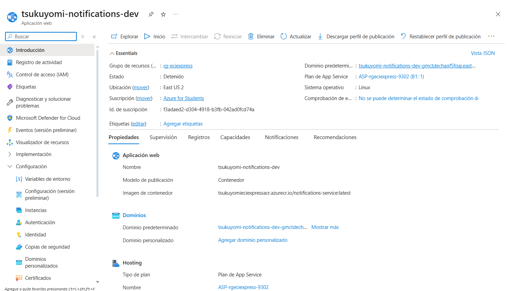
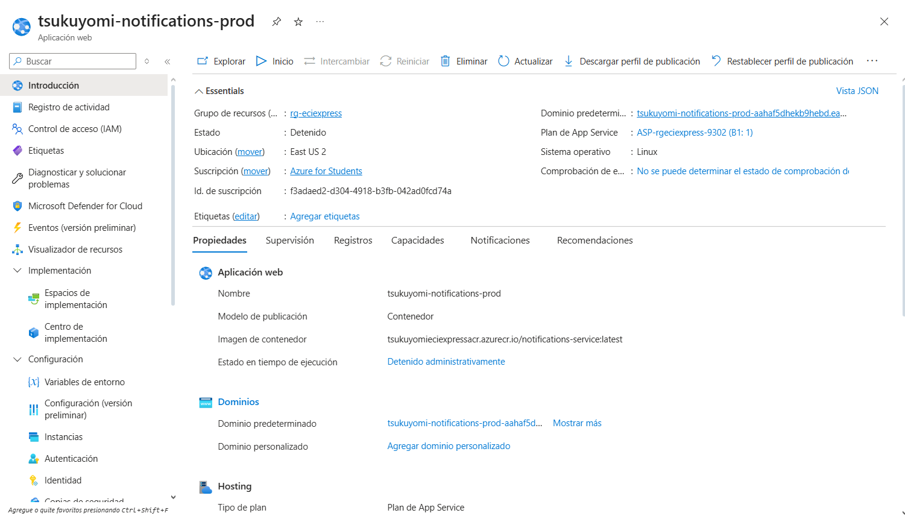

<div align="center">

# 📚 ECIEXPRESS — Sistema de Notificaciones Backend

### *"Sin filas, sin estrés, ECIEXPRESS"*

---

### 🛠️ Stack Tecnológico


### ☁️ Infraestructura & Calidad


### 🏗️ Arquitectura


</div>

---

## 📑 Tabla de Contenidos

1. [👤 Integrantes](#1--integrantes)
2. [🎯 Objetivo del Proyecto](#2--objetivo-del-proyecto)
3. [⚡ Funcionalidades Principales](#3--funcionalidades-principales)
4. [📋 Estrategia de Versionamiento y Branches](#4--manejo-de-estrategia-de-versionamiento-y-branches)
   - [4.1 Convenciones para crear ramas](#41-convenciones-para-crear-ramas)
   - [4.2 Convenciones para crear commits](#42-convenciones-para-crear-commits)
5. [⚙️ Tecnologías Utilizadas](#5--tecnologias-utilizadas)
6. [🧩 Funcionalidad](#6--funcionalidad)
7. [📊 Diagramas](#7--diagramas)
8. [⚠️ Manejo de Errores](#8--manejo-de-errores)
9. [🧪 Evidencia de Pruebas y Ejecución](#9--evidencia-de-las-pruebas-y-como-ejecutarlas)
10. [🗂️ Organización del Código](#10--codigo-de-la-implementacion-organizado-en-las-respectivas-carpetas)
11. [🚀 Ejecución del Proyecto](#11--ejecucion-del-proyecto)
12. [☁️ CI/CD y Despliegue en Azure](#12--evidencia-de-cicd-y-despliegue-en-azure)
13. [🤝 Contribuciones](#13--contribuciones)


---

## 1. 👤 Integrantes:

- Sebastian Ortega
- Nikolas Martinez
- Manuel Guarnizo
- Sofia Ariza

## 2. 🎯 Objetivo del Proyecto

En la actualidad, las cafeterias y papelerias dentro de nuestro campus universitario se presentan serias dificultades
operativas durante las horas pico. Estudiantes, docentes y personal administrativo deben enfrentar largas filas y
esperas prolongadas para adquirir sus alimentos o materiales pedidos, lo que genera gran perdida de tiempo, generando
retrasos a clases, desorganizacon y una mala experiencia tanto para los usuarios como para los trabajadores.

El modelo de atención presencial genera mucha agromelación, errores en pedidos y pagos, poca trazabilidad en las ventas,
generando poca eficiencia operativa. Por lo cual se requiere un sistema digital que optimice los procesos de compra, para
reducir los tiempos de espera y mejorando la experiencia de todos.

---

## 3. ⚡ Funcionalidades principales

- **Notificaciones en tiempo real mediante WebSocket**: Envío instantáneo de alertas a usuarios conectados a través del protocolo STOMP
- **Notificaciones por correo electrónico**: Envío de emails HTML personalizados para eventos críticos (login, recuperación de contraseña, confirmación de pagos)
- **Gestión de notificaciones de pedidos**: Alertas sobre nuevos pedidos, cambios de estado y actualizaciones en tiempo real
- **Sistema de recuperación de contraseña**: Notificaciones con códigos de verificación y confirmación de cambios exitosos
- **Notificaciones de actividad de sesión**: Alertas de seguridad cuando se detectan nuevos inicios de sesión
- **Notificaciones de pagos**: Confirmación de pagos exitosos y alertas de pagos fallidos con instrucciones de resolución
- **Historial de notificaciones**: Consulta de notificaciones previas filtradas por usuario y tipo
- **Sistema de lectura de notificaciones**: Marcado de notificaciones como leídas y consulta de pendientes
- **Multi-canal con trazabilidad**: Registro de intentos de entrega por cada canal (WebSocket, Email) con estado de éxito/fallo


## 4. 📋 Manejo de Estrategia de versionamiento y branches

### Estrategia de Ramas (Git Flow)

-

### Ramas y propósito
- Manejaremos GitFlow, el modelo de ramificación para el control de versiones de Git

#### `main`
- **Propósito:** rama **estable** con la versión final (lista para demo/producción).
- **Reglas:**
    - Solo recibe merges desde `release/*` y `hotfix/*`.
    - Cada merge a `main` debe crear un **tag** SemVer (`vX.Y.Z`).
    - Rama **protegida**: PR obligatorio, 1–2 aprobaciones, checks de CI en verde.

#### `develop`
- **Propósito:** integración continua de trabajo; base de nuevas funcionalidades.
- **Reglas:**
    - Recibe merges desde `feature/*` y también desde `release/*` al finalizar un release.
    - Rama **protegida** similar a `main`.

#### `feature/*`
- **Propósito:** desarrollo de una funcionalidad, refactor o spike.
- **Base:** `develop`.
- **Cierre:** se fusiona a `develop` mediante **PR**


#### `release/*`
- **Propósito:** congelar cambios para estabilizar pruebas, textos y versiones previas al deploy.
- **Base:** `develop`.
- **Cierre:** merge a `main` (crear **tag** `vX.Y.Z`) **y** merge de vuelta a `develop`.
- **Ejemplo de nombre:**  
  `release/1.3.0`

#### `hotfix/*`
- **Propósito:** corregir un bug **crítico** detectado en `main`.
- **Base:** `main`.
- **Cierre:** merge a `main` (crear **tag** de **PATCH**) **y** merge a `develop` para mantener paridad.
- **Ejemplos de nombre:**  
  `hotfix/fix-blank-screen`, `hotfix/css-broken-header`


---

### 4.1 Convenciones para **crear ramas**

#### `feature/*`
**Formato:**
```
feature/[nombre-funcionalidad]-ECIExpress_[codigo-jira]
```

**Ejemplos:**
- `feature/readme_ECIExpress-34`

**Reglas de nomenclatura:**
- Usar **kebab-case** (palabras separadas por guiones)
- Máximo 50 caracteres en total
- Descripción clara y específica de la funcionalidad
- Código de Jira obligatorio para trazabilidad

#### `release/*`
**Formato:**
```
release/[version]
```
**Ejemplo:** `release/1.3.0`

#### `hotfix/*`
**Formato:**
```
hotfix/[descripcion-breve-del-fix]
```
**Ejemplos:**
- `hotfix/corregir-pantalla-blanca`
- `hotfix/arreglar-header-responsive`

---

### 4.2 Convenciones para **crear commits**

#### **Formato:**
```
[codigo-jira] [tipo]: [descripción específica de la acción]
```

#### **Tipos de commit:**
- `feat`: Nueva funcionalidad
- `fix`: Corrección de errores
- `docs`: Cambios en documentación
- `style`: Cambios de formato/estilo (espacios, punto y coma, etc.)
- `refactor`: Refactorización de código sin cambios funcionales
- `test`: Agregar o modificar tests
- `chore`: Tareas de mantenimiento, configuración, dependencias

#### **Ejemplos de commits específicos:**
```bash
# ✅ BUENOS EJEMPLOS
git commit -m "26-feat: agregar validación de email en formulario login"
git commit -m "24-fix: corregir error de navegación en header mobile"


# ❌ EVITAR 
git commit -m "23-feat: agregar login"
git commit -m "24-fix: arreglar bug"

```

#### **Reglas para commits específicos:**
1. **Un commit = Una acción específica**: Cada commit debe representar un cambio lógico y completo
2. **Máximo 72 caracteres**: Para que sea legible en todas las herramientas Git
3. **Usar imperativo**: "agregar", "corregir", "actualizar" (no "agregado", "corrigiendo")
4. **Ser descriptivo**: Especificar QUÉ se cambió y DÓNDE
5. **Commits frecuentes**: Mejor muchos commits pequeños que pocos grandes

#### **Beneficios de commits específicos:**
- 🔄 **Rollback preciso**: Poder revertir solo la parte problemática
- 🔍 **Debugging eficiente**: Identificar rápidamente cuándo se introdujo un bug
- 📖 **Historial legible**: Entender la evolución del código
- 🤝 **Colaboración mejorada**: Reviews más fáciles y claras


---


## 5. ⚙️Tecnologías utilizadas

El backend del sistema ECIExpress fue desarrollado con una arquitectura basada en **Spring Boot** y componentes del
ecosistema **Java**, garantizando modularidad, mantenibilidad, seguridad y facilidad de despliegue. A continuación se
detallan las principales tecnologías empleadas en el proyecto:

| **Tecnología / Herramienta** | **Versión / Framework** | **Uso principal en el proyecto** |
|------------------------------|--------------------------|----------------------------------|
| **Java OpenJDK** | 17 | Lenguaje de programación base del backend, orientado a objetos y multiplataforma. |
| **Spring Boot** | 3.x | Framework principal para la creación del API REST, manejo de dependencias e inyección de componentes. |
| **Spring Web** | — | Implementación del modelo MVC y exposición de endpoints REST. |
| **Spring Security** | — | Configuración de autenticación y autorización de usuarios mediante roles y validación de credenciales. |
| **Spring Data MongoDB** | — | Integración con la base de datos NoSQL MongoDB mediante el patrón Repository. |
| **MongoDB Atlas** | 6.x | Base de datos NoSQL en la nube utilizada para almacenar las entidades del sistema. |
| **Apache Maven** | 3.9.x | Gestión de dependencias, empaquetado del proyecto y automatización de builds. |
| **Lombok** | — | Reducción de código repetitivo con anotaciones como `@Getter`, `@Setter`, `@Builder` y `@AllArgsConstructor`. |
| **JUnit 5** | — | Framework para pruebas unitarias que garantiza el correcto funcionamiento de los servicios. |
| **Mockito** | — | Simulación de dependencias para pruebas unitarias sin requerir acceso a la base de datos real. |
| **JaCoCo** | — | Generación de reportes de cobertura de código para evaluar la efectividad de las pruebas. |
| **SonarQube** | — | Análisis estático del código fuente y control de calidad para detectar vulnerabilidades y malas prácticas. |
| **Swagger (OpenAPI 3)** | — | Generación automática de documentación y prueba interactiva de los endpoints REST. |
| **Postman** | — | Entorno de pruebas de la API, utilizado para validar respuestas en formato JSON con los métodos `POST`, `GET`, `PATCH` y `DELETE`. |
| **Docker** | — | Contenerización del servicio para garantizar despliegues consistentes en distintos entornos. |
| **Azure App Service** | — | Entorno de ejecución en la nube para el despliegue automático del backend. |
| **Azure DevOps** | — | Plataforma para la gestión ágil del proyecto, seguimiento de tareas y control de versiones. |
| **GitHub Actions** | — | Configuración de pipelines de integración y despliegue continuo (CI/CD). |
| **SSL / HTTPS** | — | Implementación de certificados digitales para asegurar la comunicación entre cliente y servidor. |

> 🧠 Estas tecnologías fueron seleccionadas para asegurar **escalabilidad**, **modularidad**, **seguridad**, **trazabilidad** y **mantenibilidad** del sistema, aplicando buenas prácticas de ingeniería de software y estándares de desarrollo moderno.


## 6. 🧩 Funcionalidad

Este backend implementa un **sistema integral de notificaciones multi-canal** que mantiene informados a los usuarios sobre eventos importantes del ecosistema universitario. El sistema procesa eventos desde otros microservicios y envía alertas a través de múltiples canales (WebSocket, Email) con trazabilidad completa.

---

### 🔑 Funcionalidades principales

#### 1️⃣ **Recepción y Procesamiento de Eventos**

El sistema recibe eventos desde otros microservicios mediante **Redis Pub/Sub** y endpoints REST, procesándolos de forma asíncrona.

| **Funcionalidad** | **Endpoint** | **Método HTTP** | **Descripción** |
|-------------------|--------------|-----------------|-----------------|
| **Evento de login exitoso** | `/api/events/successful-login` | `POST` | Procesa eventos de inicio de sesión y envía notificación de seguridad |
| **Nuevo pedido** | `/api/events/new-order` | `POST` | Notifica al usuario sobre la creación de un nuevo pedido |
| **Cambio de estado de pedido** | `/api/events/order-status-change` | `POST` | Informa sobre actualizaciones en el estado de los pedidos |
| **Solicitud de recuperación de contraseña** | *Redis: `password-reset-request`* | — | Envía código de verificación por email |
| **Verificación de código** | *Redis: `password-reset-verified`* | — | Confirma validación del código de recuperación |
| **Contraseña actualizada** | *Redis: `password-reset-completed`* | — | Confirma cambio exitoso de contraseña |
| **Pago completado** | *Redis: `payment-completed`* | — | Notifica confirmación de pago exitoso |
| **Pago fallido** | *Redis: `payment-failed`* | — | Alerta sobre fallo en el pago con instrucciones |

**Ejemplo de uso:**

`POST /api/events/successful-login`
```json
{
  "userId": "user-123",
  "email": "usuario@escuelaing.edu.co",
  "name": "Juan Pérez",
  "ip": "192.168.1.100"
}
```

**Respuesta:**
```json
{
  "message": "Login event processed successfully"
}
```

---

#### 2️⃣ **Consulta y Gestión de Notificaciones**

Permite a los usuarios consultar su historial de notificaciones con filtros avanzados.

| **Funcionalidad** | **Endpoint** | **Método HTTP** | **Descripción** |
|-------------------|--------------|-----------------|-----------------|
| **Obtener notificaciones del usuario** | `/api/notifications/user/{userId}` | `GET` | Lista todas las notificaciones de un usuario con filtros opcionales |
| **Obtener notificaciones no leídas** | `/api/notifications/user/{userId}/unread` | `GET` | Recupera solo las notificaciones pendientes de lectura |
| **Obtener notificación específica** | `/api/notifications/{id}` | `GET` | Consulta una notificación por su ID |
| **Marcar como leída** | `/api/notifications/{id}/read` | `PUT` | Marca una notificación como leída |
| **Eliminar notificación** | `/api/notifications/{id}` | `DELETE` | Elimina una notificación del sistema |
| **Estadísticas del usuario** | `/api/notifications/stats/user/{userId}` | `GET` | Obtiene métricas de notificaciones (total, leídas, no leídas, por tipo) |

**Parámetros de filtrado (query params):**
- `status` (opcional): Filtra por estado (`SENT`, `READ`, `PENDING`, `FAILED`)
- `type` (opcional): Filtra por tipo (`LOGIN`, `ORDER`, `PAYMENT`, `PASSWORD_RESET`)

**Ejemplo de consulta con filtros:**

`GET /api/notifications/user/user-123?status=SENT&type=ORDER`

**Respuesta:**
```json
[
  {
    "id": "notif-456",
    "userId": "user-123",
    "userEmail": "usuario@escuelaing.edu.co",
    "title": "Nuevo Pedido Creado",
    "message": "Tu pedido #ORD-789 ha sido registrado exitosamente",
    "type": "ORDER",
    "status": "SENT",
    "createdAt": "2025-12-02T10:30:00",
    "readAt": null,
    "channels": ["WEBSOCKET", "EMAIL"],
    "metadata": {
      "orderId": "ORD-789",
      "orderStatus": "PENDING"
    },
    "deliveryAttempts": [
      {
        "channel": "WEBSOCKET",
        "successful": true,
        "attemptedAt": "2025-12-02T10:30:01"
      },
      {
        "channel": "EMAIL",
        "successful": true,
        "attemptedAt": "2025-12-02T10:30:02"
      }
    ]
  }
]
```

---

#### 3️⃣ **Notificaciones en Tiempo Real (WebSocket)**

El sistema utiliza **WebSocket** con protocolo **STOMP** para enviar notificaciones instantáneas a usuarios conectados.

| **Funcionalidad** | **Destino WebSocket** | **Descripción** |
|-------------------|----------------------|-----------------|
| **Suscripción a notificaciones** | `/app/notifications.subscribe` | Registra al usuario para recibir notificaciones en tiempo real |
| **Marcar como leída via WebSocket** | `/app/notifications.markRead` | Marca una notificación como leída desde el cliente WebSocket |
| **Test de conexión** | `/app/notifications.test` | Verifica conectividad del WebSocket |

**Suscripciones (Topics):**
- `/topic/notifications/{userId}` - Canal personal para recibir notificaciones del usuario específico
- `/topic/notifications` - Canal global para notificaciones broadcast
- `/topic/notifications.status` - Estado de suscripciones

**Flujo de notificación en tiempo real:**
1. Evento llega al backend (REST o Redis Pub/Sub)
2. Backend procesa el evento y crea la notificación
3. Notificación se persiste en MongoDB
4. Backend envía notificación via email (si aplica)
5. Backend hace broadcast via WebSocket → `/topic/notifications/{userId}`
6. Cliente conectado recibe la notificación instantáneamente

**Ejemplo de mensaje WebSocket recibido:**
```json
{
  "id": "notif-456",
  "type": "NOTIFICATION",
  "userId": "user-123",
  "title": "Pago Confirmado",
  "message": "Tu pago de $45.000 ha sido procesado exitosamente",
  "notificationType": "PAYMENT",
  "status": "SENT",
  "createdAt": "2025-12-02T10:30:00",
  "metadata": {
    "paymentId": "PAY-999",
    "amount": 45000
  },
  "timestamp": "2025-12-02T10:30:05"
}
```

---

#### 4️⃣ **Sistema de Notificaciones por Email**

Envío automático de correos HTML personalizados para eventos críticos.

| **Tipo de Notificación** | **Asunto del Email** | **Contenido** |
|---------------------------|----------------------|---------------|
| **Login exitoso** | "Nueva Actividad de Inicio de Sesión - ECI Express" | Alerta de seguridad con IP y timestamp del acceso |
| **Recuperación de contraseña** | "Código de Verificación - Recuperación de Contraseña" | Código de 6 dígitos con tiempo de expiración |
| **Contraseña actualizada** | "Contraseña Actualizada Exitosamente" | Confirmación de cambio de contraseña |
| **Pago completado** | "Confirmación de Pago - ECI Express" | Detalles de la transacción exitosa |
| **Pago fallido** | "Error en el Pago - ECI Express" | Información del error e instrucciones de solución |

**Características de los emails:**
- ✅ Plantillas HTML responsive
- ✅ Diseño profesional con branding de ECI Express
- ✅ Información contextual y llamados a la acción
- ✅ Retry automático en caso de fallo de envío
- ✅ Registro de intentos de entrega

---

#### 5️⃣ **Trazabilidad y Auditoría**

Cada notificación registra información detallada sobre su ciclo de vida.

| **Información Registrada** | **Descripción** |
|---------------------------|-----------------|
| **Canal de entrega** | WebSocket, Email, o ambos |
| **Intentos de entrega** | Timestamp y resultado de cada intento por canal |
| **Estado de lectura** | Marca temporal cuando el usuario visualiza la notificación |
| **Metadata contextual** | Información adicional del evento (IDs, montos, estados, etc.) |
| **Persistencia en MongoDB** | Almacenamiento permanente para consultas históricas |

**Estructura de delivery attempts:**
```json
{
  "deliveryAttempts": [
    {
      "channel": "EMAIL",
      "successful": true,
      "attemptedAt": "2025-12-02T10:30:02",
      "errorMessage": null
    },
    {
      "channel": "WEBSOCKET",
      "successful": true,
      "attemptedAt": "2025-12-02T10:30:01",
      "errorMessage": null
    }
  ]
}
```

---

### 🔐 Seguridad y Validación

El sistema implementa múltiples capas de seguridad:

- ✅ **Validación de userId** en todas las operaciones de consulta
- ✅ **Autenticación en WebSocket** mediante identificación del usuario
- ✅ **Sanitización de datos** antes de persistir en MongoDB
- ✅ **Validación de DTOs** con Bean Validation (`@NotNull`, `@NotBlank`, `@Email`)
- ✅ **Manejo centralizado de errores** con respuestas estandarizadas
- ✅ **Logging detallado** de todas las operaciones críticas

**Ejemplo de validación en DTO:**
```java
@Data
public class LoginEventCommand {
    @NotBlank(message = "User ID is required")
    private String userId;
    
    @Email(message = "Valid email is required")
    @NotBlank(message = "Email is required")
    private String email;
    
    @NotBlank(message = "Name is required")
    private String name;
    
    @NotBlank(message = "IP address is required")
    private String ip;
}
```

---

### 📡 Arquitectura de Comunicación

El sistema implementa tres canales de comunicación:

| **Canal** | **Protocolo** | **Uso** | **Ventajas** |
|-----------|---------------|---------|--------------|
| **REST API** | HTTP/HTTPS | Consulta de notificaciones, marcado como leídas | Simplicidad, cacheable, stateless |
| **WebSocket** | STOMP sobre WebSocket | Entrega de notificaciones en tiempo real | Bidireccional, baja latencia, push instantáneo |
| **Redis Pub/Sub** | Redis Protocol | Recepción de eventos desde microservicios | Asíncrono, desacoplado, escalable |
| **SMTP** | Email Protocol | Envío de notificaciones por correo | Persistente, universal, formal |

**Diagrama de flujo:**
```
Microservicios (Users, Orders, Payments)
    ↓ Redis Pub/Sub
Backend Notifications
    ↓ WebSocket (STOMP) + Email (SMTP)
Cliente Frontend + Email Client
```

---

### ✨ Casos de Uso Implementados

| **Caso de Uso** | **Actor** | **Descripción** |
|-----------------|-----------|-----------------|
| **Notificar login sospechoso** | Sistema | Envía alerta de seguridad al detectar login desde nueva ubicación |
| **Confirmar creación de pedido** | Usuario/Vendedor | Notifica a ambas partes cuando se crea un nuevo pedido |
| **Informar cambio de estado** | Usuario | Actualiza al comprador sobre el progreso de su pedido |
| **Enviar código de recuperación** | Usuario | Envía código de 6 dígitos para restablecer contraseña |
| **Confirmar pago exitoso** | Usuario | Notifica completado del pago con detalles de la transacción |
| **Alertar fallo de pago** | Usuario | Informa sobre error en el pago con instrucciones de resolución |
| **Ver historial de notificaciones** | Usuario | Consulta todas las notificaciones recibidas |
| **Filtrar notificaciones por tipo** | Usuario | Busca notificaciones específicas (pagos, pedidos, etc.) |
| **Ver estadísticas** | Usuario | Consulta métricas de notificaciones leídas/no leídas |

---

### 🎯 Beneficios de las Funcionalidades

| **Beneficio** | **Impacto** |
|---------------|-------------|
| 🔔 **Notificaciones instantáneas** | Los usuarios están siempre informados sin necesidad de consultar manualmente |
| 📧 **Multi-canal** | Mayor alcance al combinar WebSocket y Email |
| 📊 **Trazabilidad completa** | Auditoría de todas las notificaciones y sus intentos de entrega |
| 🔍 **Filtrado avanzado** | Búsqueda eficiente por tipo, estado y usuario |
| 🔄 **Desacoplamiento** | Arquitectura basada en eventos facilita escalabilidad |
| 🛡️ **Seguridad** | Validaciones en múltiples capas protegen la integridad del sistema |
| 📈 **Estadísticas** | Métricas en tiempo real sobre el estado de las notificaciones |
| ⚡ **Alto rendimiento** | Procesamiento asíncrono evita bloqueos en otros servicios |

---


## 7. 📊 Diagramas


## 8. ⚠️ Manejo de Errores

El backend de **ECIExpress** implementa un **mecanismo centralizado de manejo de errores** que garantiza uniformidad, claridad y seguridad en todas las respuestas enviadas al cliente cuando ocurre un fallo.

Este sistema permite mantener una comunicación clara entre el backend y el frontend, asegurando que los mensajes de error sean legibles, útiles y coherentes, sin exponer información sensible del servidor.

---

### 🧠 Estrategia general de manejo de errores

El sistema utiliza una **clase global** que intercepta todas las excepciones lanzadas desde los controladores REST.  
A través de la anotación `@ControllerAdvice`, se centraliza el manejo de errores, evitando el uso repetitivo de bloques `try-catch` en cada endpoint.

Cada error se transforma en una respuesta **JSON estandarizada**, que mantiene un formato uniforme para todos los tipos de fallos.

**📋 Estructura del mensaje de error:**

```json
{
  "timestamp": "2025-11-10T10:30:00Z",
  "status": 404,
  "error": "Not Found",
  "message": "Usuario no encontrado.",
  "path": "/api/credentials/{email}"
}
```

---

### ⚙️ Global Exception Handler

El **Global Exception Handler** es una clase con la anotación `@ControllerAdvice` que captura y maneja todas las excepciones del sistema.  
Utiliza métodos con `@ExceptionHandler` para procesar errores específicos y devolver una respuesta personalizada acorde al tipo de excepción.

**✨ Características principales:**

- ✅ **Centraliza** la captura de excepciones desde todos los controladores
- ✅ **Retorna mensajes JSON consistentes** con el mismo formato estructurado
- ✅ **Asigna códigos HTTP** según la naturaleza del error (400, 404, 409, 500, etc.)
- ✅ **Define mensajes descriptivos** que ayudan tanto al desarrollador como al usuario
- ✅ **Mantiene la aplicación limpia**, eliminando bloques try-catch redundantes
- ✅ **Mejora la trazabilidad** y facilita la depuración en los entornos de prueba y producción

**🔄 Ejemplo conceptual de funcionamiento:**

Cuando se lanza una excepción del tipo `EntityNotFoundException`, el handler la intercepta y genera automáticamente una respuesta como:

```json
{
  "status": 404,
  "error": "Not Found",
  "message": "Usuario no encontrado.",
  "path": "/api/credentials/{email}"
}
```

---

### 🧩 Validaciones en DTOs

Además del manejo global de errores, el sistema utiliza **validaciones automáticas** sobre los DTOs (Data Transfer Objects) para garantizar que los datos que llegan al servidor cumplan con las reglas de negocio antes de ejecutar cualquier lógica.

Estas validaciones se implementan mediante las anotaciones de **Javax Validation** y **Hibernate Validator**, como `@NotBlank`, `@NotNull`, `@Email`, `@Min`, `@Max`, entre otras.

**📝 Ejemplo de DTO con validaciones:**

```java

```

Si alguno de los campos no cumple las validaciones, se lanza automáticamente una excepción del tipo `MethodArgumentNotValidException`.  
Esta es capturada por el **Global Exception Handler**, que devuelve una respuesta JSON estandarizada con el detalle del campo inválido.

**⚠️ Ejemplo de respuesta ante error de validación:**

```json
{
  "status": 400,
  "error": "Bad Request",
  "message": "El campo 'email' debe tener un formato válido."
}
```

> 💡 Gracias a este mecanismo, se asegura que las peticiones erróneas sean detectadas desde el inicio, reduciendo fallos en capas más profundas como servicios o repositorios.

---

### 📊 Tipos de errores manejados

La siguiente tabla resume los principales tipos de excepciones manejadas en el sistema, junto con su respectivo código HTTP y un ejemplo de mensaje retornado:

| **Excepción** | **Código HTTP** | **Descripción del error** | **Ejemplo de mensaje** |
|---------------|-----------------|---------------------------|------------------------|
| `HttpMessageNotReadableException` | `400 Bad Request` | Error al parsear el cuerpo JSON de la petición | *"Invalid JSON format - Check the request body structure"* |
| `MethodArgumentNotValidException` | `400 Bad Request` | Error de validación en un DTO o parámetro de entrada | *"El campo 'email' debe tener un formato válido."* |
| `IllegalArgumentException` | `400 Bad Request` | Parámetros inválidos o peticiones mal estructuradas | *"El campo 'userId' no puede ser nulo."* |
| `RuntimeException` (Notificaciones) | | **Agrupa múltiples errores del procesamiento de notificaciones:** | |
| └─ `Error processing login notification` | `500 Internal Server Error` | Fallo al procesar notificación de inicio de sesión | *"Error processing login notification"* |
| └─ `Error processing new order notification` | `500 Internal Server Error` | Fallo al crear notificación de nuevo pedido | *"Error processing new order notification"* |
| └─ `Error processing order status notification` | `500 Internal Server Error` | Fallo al notificar cambio de estado de pedido | *"Error processing order status notification"* |
| └─ `Error processing password reset notification` | `500 Internal Server Error` | Fallo al enviar código de recuperación de contraseña | *"Error processing password reset notification"* |
| └─ `Error processing password reset verification` | `500 Internal Server Error` | Fallo al confirmar verificación de código | *"Error processing password reset verification"* |
| └─ `Error processing password reset completion` | `500 Internal Server Error` | Fallo al notificar cambio exitoso de contraseña | *"Error processing password reset completion"* |
| └─ `Error processing payment completed notification` | `500 Internal Server Error` | Fallo al notificar pago completado | *"Error processing payment completed notification"* |
| └─ `Error processing payment failed notification` | `500 Internal Server Error` | Fallo al notificar pago fallido | *"Error processing payment failed notification"* |
| `MailException` | `500 Internal Server Error` | Fallo al enviar correos electrónicos | *"Failed to send email notification"* |
| `Exception` | `500 Internal Server Error` | Error interno no controlado del servidor | *"An unexpected error occurred. Please try again later."* |

---

### ✅ Beneficios del manejo centralizado

| **Beneficio** | **Descripción** |
|---------------|-----------------|
| 🎯 **Uniformidad** | Todas las respuestas de error tienen el mismo formato JSON |
| 🔧 **Mantenibilidad** | Agregar nuevas excepciones no requiere modificar cada controlador |
| 🔒 **Seguridad** | Oculta los detalles internos del servidor y evita exponer trazas del sistema |
| 📍 **Trazabilidad** | Cada error incluye información contextual (ruta y hora exacta) |
| 🤝 **Integración fluida** | Facilita la comunicación con el frontend y herramientas como Postman o Swagger |

---

> Gracias a este enfoque, el backend de ECIExpress logra un manejo de errores **robusto**, **escalable** y **seguro**, garantizando una experiencia de usuario más confiable y profesional.

---


---

## 9. 🧪 Evidencia de las pruebas y cómo ejecutarlas


## 10. 🗂️ Código de la implementación organizado en las respectivas carpetas

El proyecto **Tsukuyomi Notifications Backend** sigue una **arquitectura hexagonal (puertos y adaptadores)** que separa las responsabilidades en capas bien definidas, promoviendo la escalabilidad, testabilidad y mantenibilidad del código.

---

### 📂 Estructura general del proyecto (Scaffolding)

```
TSUKUYOMI-Notifications-Backend/
│
├── 📁 src/
│   ├── 📁 main/
│   │   ├── 📁 java/edu/dosw/
│   │   │   ├── 📄 Application.java              # Clase principal de Spring Boot
│   │   │   │
│   │   │   ├── 📁 domain/                       # 🟢 Capa de Dominio
│   │   │   │   ├── 📁 model/                    # Entidades del negocio
│   │   │   │   │   ├── Notification.java        # Entidad principal de notificación
│   │   │   │   │   └── 📁 ValueObject/          # Objetos de valor del dominio
│   │   │   │   └── 📁 ports/                    # Interfaces (contratos del dominio)
│   │   │   │
│   │   │   ├── 📁 application/                  # 🔵 Capa de Aplicación
│   │   │   │   ├── 📁 services/                 # Implementación de casos de uso
│   │   │   │   │
│   │   │   │   ├── 📁 ports/                    # Interfaces de servicios
│   │   │   │   │
│   │   │   │   └── 📁 dto/                      # Data Transfer Objects
│   │   │   │       ├── 📁 command/              # DTOs de entrada (comandos)
│   │   │   │       └── 📁 query/                # DTOs de salida (respuestas)
│   │   │   │
│   │   │   ├── 📁 infrastructure/               # 🟠 Capa de Infraestructura
│   │   │   │   ├── 📁 web/                      # Adaptadores REST
│   │   │   │   │   ├── 📁 controllers/          # Controladores REST
│   │   │   │   │   └── 📁 mappers/              # Mappers Web ↔ Dominio
│   │   │   │   │
│   │   │   │   ├── 📁 persistence/              # Adaptadores de MongoDB
│   │   │   │   │   ├── 📁 documents/            # Documentos MongoDB
│   │   │   │   │   └── 📁 mappers/              # Mappers BD ↔ Dominio
│   │   │   │   │
│   │   │   │   ├── 📁 email/                    # Adaptador de correo electrónico
│   │   │   │   │
│   │   │   │   ├── 📁 websocket/                # Adaptador de WebSocket
│   │   │   │   │
│   │   │   │   └── 📁 event/                    # Adaptador de eventos Redis
│   │   │   │
│   │   │   ├── 📁 config/                       # 🔧 Configuraciones de Spring
│   │   │   │
│   │   │   └── 📁 exception/                    # ⚠️ Manejo de excepciones
│   │   │
│   │   └── 📁 resources/
│   │       ├── application.properties           # Configuración local
│   │       └── application-docker.properties    # Configuración para Docker

```

---

### 🏛️ Arquitectura Hexagonal

El proyecto implementa **Arquitectura Hexagonal (Ports & Adapters)** con tres capas principales:

| **Capa** | **Responsabilidad** | **Dependencias** |
|----------|---------------------|------------------|
| **🟢 Domain** | Lógica de negocio pura, entidades del dominio (`Notification`) y contratos (ports) | Ninguna (independiente de frameworks) |
| **🔵 Application** | Orquestación de casos de uso, procesamiento de eventos y servicios de consulta | Solo depende de Domain |
| **🟠 Infrastructure** | Adaptadores externos (REST, MongoDB, Redis, Email, WebSocket, configuraciones) | Depende de Domain y Application |

**Flujo de dependencias:** `Infrastructure → Application → Domain`

---

### 📦 Descripción de las capas

#### 🟢 **Domain Layer (Capa de Dominio)**

Contiene la lógica de negocio pura y las entidades del dominio, **completamente independiente** de frameworks y librerías externas.

| **Componente** | **Descripción** |
|----------------|-----------------|
| **Notification** | Entidad principal que representa una notificación con su ciclo de vida completo |
| **Value Objects** | Objetos inmutables del dominio: `NotificationId`, `Channel`, `NotificationType`, `NotificationStatus`, `DeliveryAttempt` |
| **Ports (Interfaces)** | Contratos que definen cómo interactuar con servicios externos sin conocer su implementación |

**Principio aplicado:** *Dependency Inversion Principle* - El dominio define QUÉ necesita, no CÓMO se implementa.

---

#### 🔵 **Application Layer (Capa de Aplicación)**

Orquesta los casos de uso del sistema, transformando eventos en notificaciones y gestionando consultas.

| **Componente** | **Descripción** |
|----------------|-----------------|
| **NotificationApplicationService** | Procesa 8 tipos de eventos (login, pedidos, pagos, contraseñas) y crea notificaciones multi-canal |
| **NotificationQueryService** | Maneja consultas: obtener por usuario, filtrar por estado/tipo, marcar como leída |
| **DTOs (Commands)** | Comandos de entrada validados: `LoginEventCommand`, `PaymentCommand`, etc. |
| **DTOs (Queries)** | Respuestas estructuradas: `NotificationResponse` con toda la información de la notificación |

**Principio aplicado:** *Single Responsibility* - Cada servicio tiene una única razón de cambio.

---

#### 🟠 **Infrastructure Layer (Capa de Infraestructura)**

Implementa los adaptadores que conectan el sistema con tecnologías externas.

| **Adaptador** | **Tecnología** | **Responsabilidad** |
|---------------|----------------|---------------------|
| **Web Controllers** | Spring MVC REST | Expone endpoints HTTP para recibir eventos y consultar notificaciones |
| **WebSocketEmitterAdapter** | STOMP / SimpMessagingTemplate | Envía notificaciones en tiempo real a usuarios conectados |
| **MongoNotificationRepository** | Spring Data MongoDB | Persiste y recupera notificaciones desde MongoDB Atlas |
| **EmailServiceAdapter** | JavaMailSender | Envía emails HTML personalizados usando SMTP |
| **GeneralEventListener** | Redis Pub/Sub | Escucha eventos desde otros microservicios vía Redis |

**Principio aplicado:** *Open/Closed Principle* - Fácil agregar nuevos adaptadores sin modificar el dominio.

---

### 🎯 Principios de diseño aplicados

✅ **Separación de responsabilidades** - Cada capa tiene un propósito único y bien definido  
✅ **Inversión de dependencias** - Las capas externas dependen de las internas, no al revés  
✅ **Independencia del framework** - La lógica de negocio no depende de Spring, MongoDB o Redis  
✅ **Testabilidad** - Fácil crear pruebas unitarias mockeando los ports (interfaces)  
✅ **Mantenibilidad** - Cambios en la infraestructura no afectan al dominio  
✅ **Escalabilidad** - Arquitectura basada en eventos permite agregar nuevos canales sin modificar el core  

---

### 🔄 Flujo de datos típico

**Ejemplo: Procesamiento de un evento de login**

```
1. Microservicio Users publica evento → Redis Pub/Sub (topic: "login-success")
                ↓
2. GeneralEventListener (Infrastructure) recibe el evento
                ↓
3. Mapea el evento a LoginEventCommand (Application DTO)
                ↓
4. Invoca NotificationApplicationService.processSuccessfulLogin()
                ↓
5. Crea entidad Notification (Domain) con los datos del evento
                ↓
6. Guarda en MongoDB via NotificationRepositoryPort
                ↓
7. Envía email via EmailServicePort (EmailServiceAdapter)
                ↓
8. Emite notificación WebSocket via WebSocketEmitterPort
                ↓
9. Frontend conectado recibe notificación instantáneamente
```

---

### 📊 Ventajas de esta arquitectura

| **Ventaja** | **Impacto en el proyecto** |
|-------------|----------------------------|
| 🧪 **Alta testabilidad** | Pruebas unitarias del dominio sin necesidad de bases de datos reales |
| 🔧 **Fácil mantenimiento** | Cambiar de MongoDB a PostgreSQL solo requiere modificar el adaptador |
| 📈 **Escalabilidad** | Agregar nuevos canales (SMS, Push) sin tocar la lógica de negocio |
| 🔄 **Reusabilidad** | El dominio puede ser usado por otros servicios sin modificaciones |
| 🎯 **Claridad** | Estructura predecible facilita onboarding de nuevos desarrolladores |

---


## 11. 🚀 Ejecución del Proyecto


## 12. ☁️ Evidencia de CI/CD y Despliegue en Azure

El proyecto implementa un **pipeline completo de CI/CD** utilizando **GitHub Actions** para automatizar el proceso de integración continua, pruebas, análisis de calidad y despliegue en **Azure Cloud**.

---

### 🔄 Pipeline de CI/CD

El proyecto cuenta con **3 workflows automatizados** que se ejecutan en diferentes momentos del ciclo de desarrollo:

| **Workflow** | **Archivo** | **Trigger** | **Propósito** |
|-------------|-------------|-------------|---------------|
| **CI - Tests & Quality** | `ci.yml` | Push/PR a `develop`, `main`, `feature/**` | Ejecutar pruebas, generar cobertura y análisis de SonarQube |
| **CD - Deploy DEV** | `cd_dev.yml` | Push a `develop` | Desplegar automáticamente al ambiente de desarrollo |
| **CD - Deploy PROD** | `cd_prod.yml` | Push a `main`, `feature/**` | Desplegar automáticamente al ambiente de producción |

---

### 🧪 CI - Integración Continua (ci.yml)

Este workflow se ejecuta en cada **push** o **pull request** para garantizar la calidad del código antes de integrar cambios.

**Pasos del pipeline CI:**

1. **Checkout del código** - Descarga el código fuente del repositorio con historial completo (`fetch-depth: 0`)
2. **Setup JDK 17** - Configura el entorno de Java con Temurin (Eclipse Adoptium)
3. **Cache de dependencias Maven** - Optimiza tiempos de build reutilizando dependencias de `~/.m2/repository`
4. **Levantar MongoDB (servicio)** - Inicia una instancia de MongoDB 7.0 con health checks para las pruebas
5. **Build + Test + Coverage** - Ejecuta `mvn clean verify` para compilar, probar y generar cobertura con JaCoCo
6. **Análisis SonarQube** - Envía métricas de calidad de código a SonarCloud/SonarQube
7. **Publicar reporte JaCoCo** - Sube el reporte HTML de cobertura como artefacto descargable

**Fragmento del workflow CI:**

```yaml
services:
  mongodb:
    image: mongo:7.0
    ports:
      - 27017:27017
    options: >-
      --health-cmd="mongosh --eval 'db.runCommand({ ping: 1 })'"
      --health-interval=10s
      --health-timeout=5s
      --health-retries=5

steps:
  - name: Build + Test + Coverage
    run: mvn -B clean verify
    env:
      SPRING_PROFILES_ACTIVE: test
      MONGODB_URI: mongodb://localhost:27017/Notifications-db

  - name: SonarQube Analysis
    run: mvn -B sonar:sonar
    env:
      SONAR_TOKEN: ${{ secrets.SONAR_TOKEN }}
      SPRING_PROFILES_ACTIVE: test
      MONGODB_URI: mongodb://localhost:27017/Notifications-db
```

**Beneficios:**
- ✅ Detección temprana de errores antes de fusionar cambios
- ✅ Garantiza que todas las pruebas pasen antes del despliegue
- ✅ Métricas de calidad de código (code smells, bugs, vulnerabilidades, cobertura)
- ✅ Reporte de cobertura de código disponible en cada build como artefacto
- ✅ MongoDB como servicio permite ejecutar tests de integración reales

---

### 🚀 CD - Despliegue Continuo (cd_dev.yml / cd_prod.yml)

Estos workflows automatizan el **despliegue** del backend en **Azure Web App** utilizando **Docker** y **Azure Container Registry (ACR)**.

**Pasos del pipeline CD:**

1. **Checkout del código** - Descarga el código fuente desde GitHub
2. **Login a Azure Container Registry** - Autenticación con credenciales almacenadas en GitHub secrets
3. **Build de la imagen Docker** - Construye la imagen con dos etiquetas: `latest` y hash corto del commit (primeros 7 caracteres)
4. **Push de la imagen a ACR** - Sube ambas etiquetas de la imagen al registro privado de contenedores de Azure
5. **Deploy a Azure Web App** - Despliega el contenedor en el App Service correspondiente (DEV o PROD) usando el perfil de publicación

**Fragmento del workflow CD:**

```yaml
- name: Build Docker image
  run: |
    IMAGE_NAME="${{ secrets.ACR_LOGIN_SERVER }}/notifications-service"
    GIT_TAG=${GITHUB_SHA::7}
    docker build -t "$IMAGE_NAME:latest" -t "$IMAGE_NAME:$GIT_TAG" .

- name: Push Docker image to ACR
  run: |
    IMAGE_NAME=${{ secrets.ACR_LOGIN_SERVER }}/notifications-service
    GIT_TAG=${GITHUB_SHA::7}
    docker push $IMAGE_NAME:latest
    docker push $IMAGE_NAME:$GIT_TAG

- name: Deploy container to Azure Web App (PROD)
  uses: azure/webapps-deploy@v3
  with:
    app-name: ${{ secrets.AZURE_WEBAPP_NAME_PROD }}
    publish-profile: ${{ secrets.AZURE_WEBAPP_PUBLISH_PROFILE_PROD }}
    images: ${{ secrets.ACR_LOGIN_SERVER }}/notifications-service:latest
```

**Estrategia de despliegue:**

- **Desarrollo (`develop`)** → Deploy automático a **Azure Web App (DEV)** - Ambiente para pruebas internas
- **Producción (`main`)** → Deploy automático a **Azure Web App (PROD)** - Ambiente de producción
- **Feature branches** → Deploy a PROD (configurado para testing antes de merge)

**Versionado de imágenes:**
- Cada imagen se etiqueta con `latest` y con el **hash corto del commit** (ej: `notifications-service:a1b2c3d`)
- Esto permite **rollback rápido** a versiones anteriores si es necesario
- El historial de imágenes queda registrado en Azure Container Registry

---

### ☁️ Infraestructura en Azure

El backend está desplegado en la nube de **Microsoft Azure** utilizando los siguientes servicios:

| **Servicio de Azure** | **Propósito** | **Configuración** |
|-----------------------|---------------|-------------------|
| **Azure Web App (App Service)** | Hosting del backend Spring Boot en contenedor Docker | Linux, Docker Container, escalable horizontalmente |
| **Azure Container Registry (ACR)** | Almacenamiento privado de imágenes Docker | Registro privado, integrado con Web App via webhook |
| **MongoDB Atlas** | Base de datos NoSQL en la nube | Cluster compartido M0, conexión segura con IP whitelisting |
| **Redis Cache** (externo) | Sistema de mensajería Pub/Sub para eventos | Instancia compartida entre microservicios |
| **Azure Application Insights** (opcional) | Monitoreo y telemetría de la aplicación | Logs, métricas, trazas distribuidas, alertas |

**Arquitectura de despliegue:**

```
GitHub Repository (push to main/develop)
           ↓
  GitHub Actions (CI/CD Pipeline)
           ↓
  Azure Container Registry (ACR)
      [notifications-service:latest]
      [notifications-service:a1b2c3d]
           ↓
  Azure Web App (App Service)
      • DEV: notifications-dev.azurewebsites.net
      • PROD: notifications-prod.azurewebsites.net
           ↓
  ┌────────────────────────────┐
  │  MongoDB Atlas (Database)  │
  │  Redis Pub/Sub (Events)    │
  │  SMTP Server (Emails)      │
  └────────────────────────────┘
```

---

### 🔐 Secrets y Variables de Entorno

Los siguientes **secrets** están configurados en GitHub para el pipeline CI/CD:

| **Secret** | **Descripción** |
|-----------|-----------------|
| `ACR_LOGIN_SERVER` | URL del Azure Container Registry (ej: `myregistry.azurecr.io`) |
| `ACR_USERNAME` | Usuario de autenticación del ACR |
| `ACR_PASSWORD` | Contraseña del ACR |
| `AZURE_WEBAPP_NAME_DEV` | Nombre del App Service de desarrollo |
| `AZURE_WEBAPP_NAME_PROD` | Nombre del App Service de producción |
| `AZURE_WEBAPP_PUBLISH_PROFILE_DEV` | Perfil de publicación para ambiente DEV |
| `AZURE_WEBAPP_PUBLISH_PROFILE_PROD` | Perfil de publicación para ambiente PROD |
| `SONAR_TOKEN` | Token de autenticación para SonarQube/SonarCloud |

---

### 📊 Evidencias de Despliegue

**🟢 Azure Web App - Ambiente de Desarrollo (DEV)**
   
   
   
   *Ambiente de desarrollo para pruebas internas del equipo*

---

**🔵 Azure Web App - Ambiente de Producción (PROD)**
   
   
   
   *Ambiente de producción accesible para usuarios finales*

---

### 📈 Flujo completo CI/CD

**Escenario: Desarrollo de nueva funcionalidad**

```
1. Developer crea feature branch: feature/email-notifications
                ↓
2. Commits + Push → Trigger CI workflow
                ↓
3. CI ejecuta: Build → Tests → Coverage → SonarQube
                ↓ (si todo pasa)
4. Pull Request a develop → Code Review
                ↓ (aprobado)
5. Merge a develop → Trigger CD DEV workflow
                ↓
6. Build Docker → Push ACR → Deploy Azure DEV
                ↓ (QA validation)
7. Pull Request a main → Final Review
                ↓ (aprobado)
8. Merge a main → Trigger CD PROD workflow
                ↓
9. Build Docker → Push ACR → Deploy Azure PROD
                ↓
10. Notificaciones disponibles en producción ✅
```

---

### ✅ Ventajas del pipeline implementado

| **Ventaja** | **Impacto en el proyecto** |
|-------------|----------------------------|
| 🚀 **Despliegue automático** | Cada commit a `main` o `develop` se despliega automáticamente sin intervención manual |
| 🧪 **Calidad garantizada** | Las pruebas y análisis se ejecutan antes de cada despliegue, evitando bugs en producción |
| 🔄 **Rollback rápido** | Versionado de imágenes Docker con hash del commit permite revertir a cualquier versión anterior |
| 📦 **Infraestructura como código** | Todo el pipeline está versionado en Git, facilitando auditorías y cambios controlados |
| 🔐 **Seguridad** | Credenciales almacenadas de forma segura en GitHub Secrets, nunca expuestas en el código |
| 📊 **Trazabilidad completa** | Historial completo de despliegues, pruebas y métricas de calidad en GitHub Actions |
| ⚡ **Feedback rápido** | Los developers reciben notificaciones inmediatas si las pruebas fallan |
| 🏗️ **Ambientes separados** | DEV y PROD aislados, permitiendo testing exhaustivo antes de ir a producción |
| 📈 **Escalabilidad** | Fácil agregar más ambientes (staging, QA) duplicando workflows |


---


## 13. 🤝 Contribuciones

El desarrollo del backend de ECIEXPRESS se realizó aplicando la **metodología ágil Scrum**, promoviendo la colaboración, la mejora continua y la entrega incremental de valor.  
Durante el proceso, el equipo Tsukuyomi trabajó en **sprints semanales**, realizando **revisiones de avance**, **dailies** y **retrospectivas**, lo que permitió mantener una comunicación fluida y adaptarse a los cambios de requisitos en tiempo real.

Cada miembro del equipo asumió un rol dentro del marco de Scrum:

| **Rol Scrum** | **Responsabilidad principal** |
|----------------|-------------------------------|
| **Product Owner** | Definir y priorizar las historias de usuario en el backlog del producto. |
| **Scrum Master** | Asegurar la aplicación de la metodología y eliminar impedimentos. |
| **Developers** | Diseñar, implementar, probar y documentar las funcionalidades. |

**Artefactos y eventos Scrum utilizados:**
- 📋 **Product Backlog:** listado de funcionalidades priorizadas y mantenidas en Jira/GitHub Projects.
- 🧩 **Sprint Backlog:** tareas seleccionadas por sprint según la capacidad del equipo.
- ⚙️ **Daily Scrum:** reuniones cortas de sincronización para identificar bloqueos y avances.
- 📦 **Sprint Review:** revisión de resultados y demostración del incremento funcional.
- 🔄 **Sprint Retrospective:** análisis de mejoras en la dinámica y la comunicación del equipo.

> 💡 Gracias al uso de Scrum, el desarrollo de Tsukuyomi se mantuvo **organizado, transparente y enfocado en la entrega continua de valor**, aplicando principios de autoorganización y aprendizaje colaborativo.

---
### Desarrollado por el equipo Tsukuyomi – DOSW 2025-2

> 💡 **ECIEXPRESS** es un proyecto académico, pero su arquitectura y calidad están pensadas para ser escalables y adaptables a escenarios reales en instituciones educativas.

---


